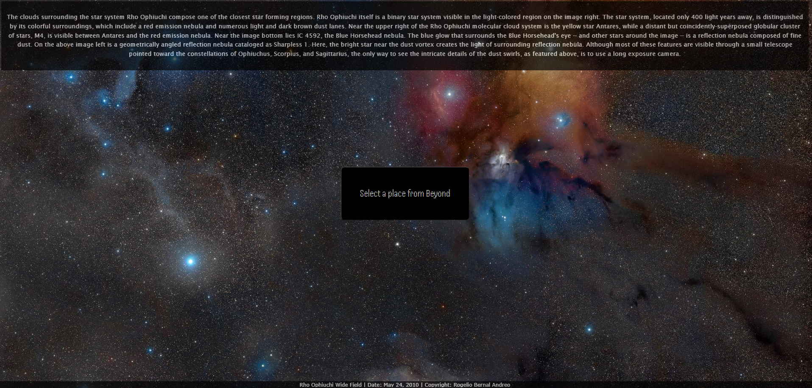
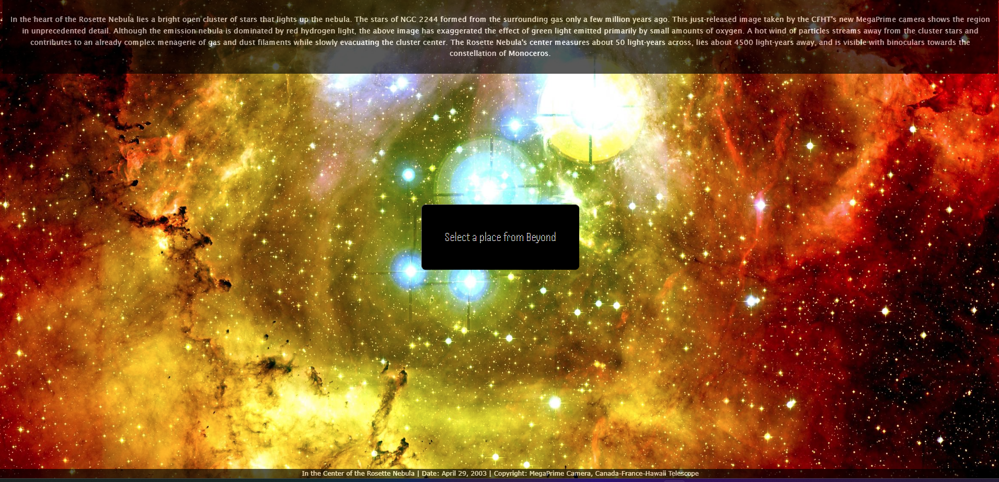
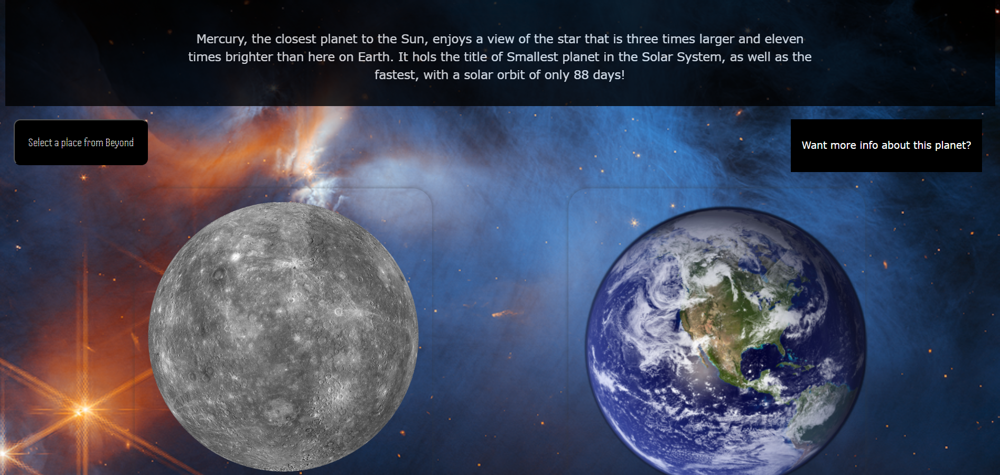
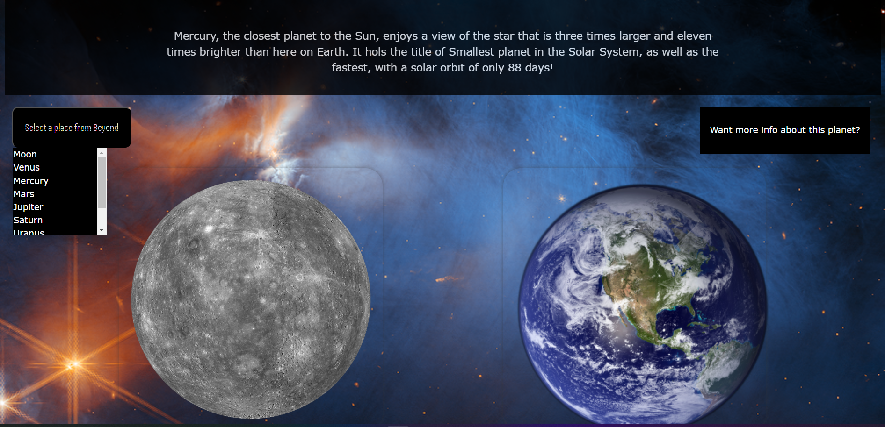
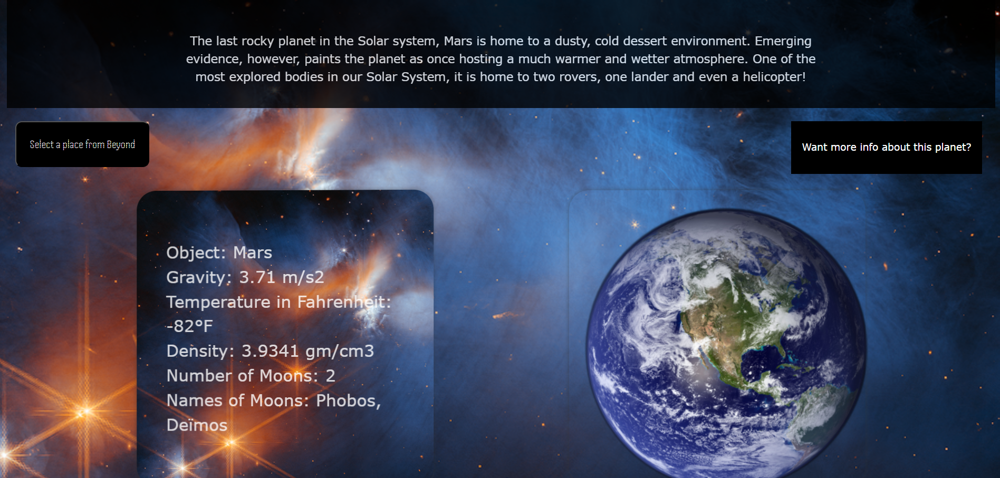
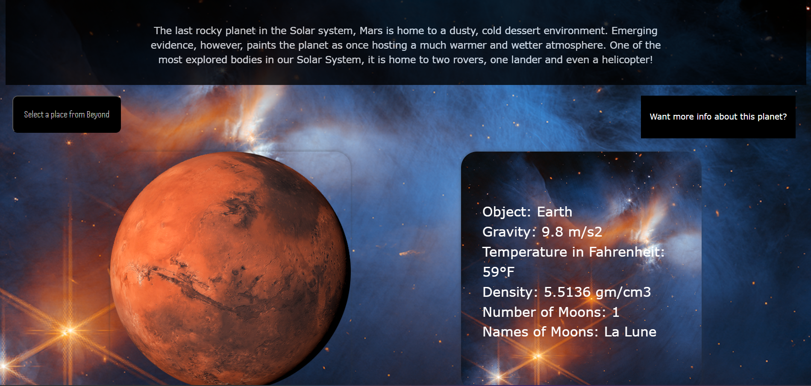
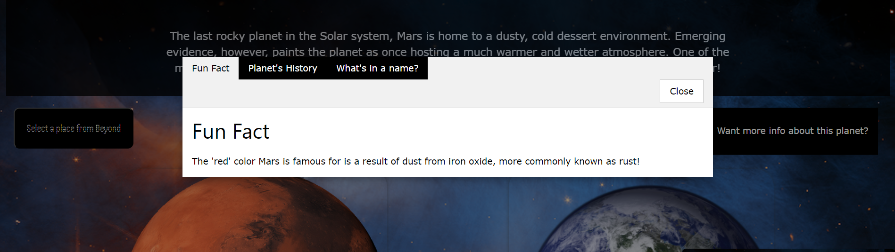

# Project-Space

# User Story
1. As a User, I want to search through Celestial Bodies in our Solar System, So that I can see how our planet compares to other bodies in our system. 

2. As a User, I want to see images of our solar system.

# Acceptance Criteria
GIVEN a webpage with clickable planet or Solar object data.
WHEN I load the index page.
THEN I am presented with a clean, easy way to select an object.
WHEN I load the index page.
THEN I am presented with a random photo of space, with information about that picture.
WHEN I select an object.
THEN I am taken to a page with data on that object, 
WHEN I see the selected object data
THEN I am given comparable data on Earth as well.

## Description

When we (Project Space: Alexa, Colton and Kalani) were first the project parameters (Two Serverside Apis connected and displaying dynamically), our first priority was to do something was unique, and did not feel like it had been done before. 

We feel we have done that with our project: A site that displays and compares data about objects in our solar system against data about the Earth. The objects are chosen by the user, pulled from the API, and displayed dynamically. The Site also features a random NASA picture of the day from their photo API.

The project was a perfect way to cap off the first third of our Fullstack Web Development Bootcamp. HTML, CSS, and most importantly, Javascript skills were all utilized to their full extent to devolp a website that we are all incredibly proud of.

There were several challenges along the way, from learning new CSS systems on the fly, to always-present git issues (big shoutout to our very patient TA Kirtley, for helping us through those!). I think we are all more confident in our own skills for having come out the other side of this Project. 

As I've said, we are all incredibly proud of our project, and can't wait to show it off. 

## Table of Contents (Optional)

If your README is long, add a table of contents to make it easy for users to find what they need.

- [Installation](#installation)
- [Usage](#usage)
- [Credits](#credits)
- [License](#license)

## Installation

There is no installation required for the operation of this website.

https://kalanij94.github.io/Project-Mars/

## Usage

To use this website, you will need to first navigate to the homepage, found [here](https://kalanij94.github.io/Project-Mars/). Once there, you will notice the background is dynamically updated upon refresh to see a different picture. These images are taken straight from NASA's [APOD API](https://api.nasa.gov/), and also feature the picture's title, the name of the person credited for the picture, and the explanation of what the picture is, also taken from the APOD API. You'll also have a dropdown menu to select "A Place From Beyond". Clicking a planet or solar object will take you to the data page.

Upon loading the data page, you will first find the header contains a short introduction to the object chosen. Below that are two buttons. To the left is the same button as the main page, which allows you to choose another object if desired. To the right is a button which will display a tabbed modal, which contains additional information about the selected object. This information is NOT pulled from the API. Both the header and information text are pulled from an array in the JS, via a looping "For" function. 

Two cards make the main section of the data page, the left being the selected object and the right being Earth. The front of the card is a photo of the object. They both rotate upon hovering over the card, to reveal certain data on those objects. That data is taken [from](https://api.le-systeme-solaire.net/en/) to display dynamically onto the cards. [Here](https://kalanij94.github.io/Project-Mars/dataPage.html) is a link directly to the data page of our website. 

## Credits

Planet Information planet API
https://api.le-systeme-solaire.net/en/

Website for NASA API Photo of the Day
https://api.nasa.gov/

Website for Data Page Background Image:
https://www.nasa.gov/multimedia/imagegallery/iotd.html

W3's CSS format Home page, used for dynamic styling of html elements:
https://www.w3schools.com/w3css/default.asp

SCSS, external CSS stylesheet:
https://sass-lang.com/

https://www.w3schools.com/w3css/tryit.asp?filename=tryw3css_modal_tab

w3 School Flip Card 
https://www.w3schools.com/howto/howto_css_flip_card.asp

## License

MIT License

Copyright (c) 2023 Kalani Jones

Permission is hereby granted, free of charge, to any person obtaining a copy
of this software and associated documentation files (the "Software"), to deal
in the Software without restriction, including without limitation the rights
to use, copy, modify, merge, publish, distribute, sublicense, and/or sell
copies of the Software, and to permit persons to whom the Software is
furnished to do so, subject to the following conditions:

The above copyright notice and this permission notice shall be included in all
copies or substantial portions of the Software.

THE SOFTWARE IS PROVIDED "AS IS", WITHOUT WARRANTY OF ANY KIND, EXPRESS OR
IMPLIED, INCLUDING BUT NOT LIMITED TO THE WARRANTIES OF MERCHANTABILITY,
FITNESS FOR A PARTICULAR PURPOSE AND NONINFRINGEMENT. IN NO EVENT SHALL THE
AUTHORS OR COPYRIGHT HOLDERS BE LIABLE FOR ANY CLAIM, DAMAGES OR OTHER
LIABILITY, WHETHER IN AN ACTION OF CONTRACT, TORT OR OTHERWISE, ARISING FROM,
OUT OF OR IN CONNECTION WITH THE SOFTWARE OR THE USE OR OTHER DEALINGS IN THE
SOFTWARE.

---

## How to Contribute

If you've like to contribute to this project, please reach out! We are incredibly proud of the work, and also of the numerous future opportunities for future features it could hold.  

Before you reach out, please be familiar with the [Contributor Covenant](https://www.contributor-covenant.org/) and the code of conduct within.